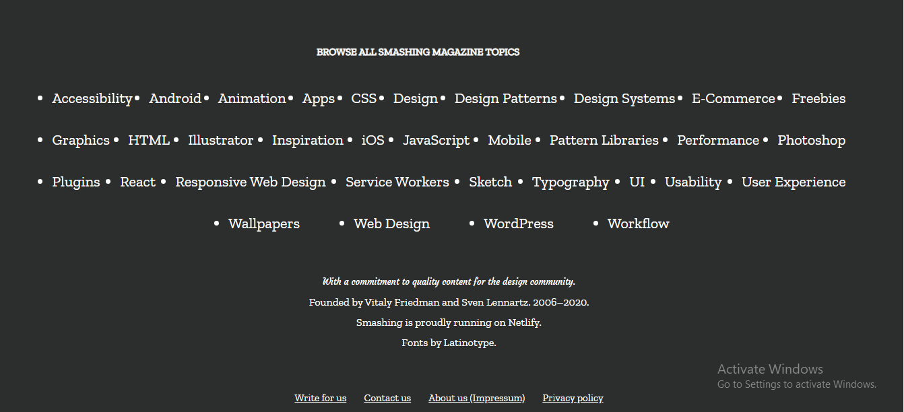

# Design Teardown

> This project consists of building a heatmap of the Smashing magazine website

Screenshot of Page

 
 

> To achieve this output we had to create a gray-scale "heat map" of sections of the page that indicate
  which elements have the greatest weight in the visual hierachy.

## Built With

- Html,
- Css

[Live Demo Link](https://rawcdn.githack.com/OA7/Design-Teardown/411d67cd5b46cfd494b09d04ba85bbc5a9ba8611/index.html)

## Authors

👤 **Osong Agberndifor**

- Github: [Osong Agberndifor](https://github.com/OA7)
- Twitter: [Osong Agberndifor](https://twitter.com/Osong17)
- Linkedin: [Osong Agberndifor](https://linkedin.com/osong-agberndifor)

👤 **Okiror Frank**

- Github: [Okiror Frank](https://github.com/frankopkusianwar)
- Twitter: [Okiror Frank](https://twitter.com/franko0781)
- Linkedin: [Okiror Frank](https://linkedin.com/in/frank-okiror-250076b5)

## 🤝 Contributing

Contributions, issues and feature requests are welcome!

Feel free to check the [issues page](https://github.com/OA7/Design-Teardown/issues).

## Show your support

Give a ⭐️ if you like this project!
